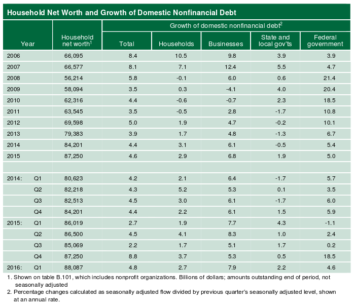

```{r setup, include=FALSE}
knitr::opts_chunk$set(echo = TRUE)
```

## Welcome & Setup

1. Log in to network 
2. Update course materials from github
    * https://github.com/wampeh1/ECOG_314
3. Open lecture file in RStudio
    * Lecture3.Rmd

***

## Midterm Project

* Instructions

***
## Homework 

* Feedback
* Next Homework

***

## Quick Assessment

What statistical software have students used in the past?

* Stata
* SAS
* Excel
* SPSS
* Matlab
* Other

Compare to the [broader trends](http://r4stats.com/articles/popularity/)

***
## Refereshers

### Rstudio Interface 

Four panels and a menu: each part of the interface serves a purpose

* **Inputs** to R from user 
    * Console: interactive R prompt 
    * Text Editor: view, create, and change contents of text files 
* **Outputs** from R 
    * Console: interactive R prompt 
    * Environment: current workspace, previous commands 
    * Viewer: View plots, help documentation, etc. 
* **Options** change the interface or R session
    * Menu: many options and functions available
    * Environment: quick access to workspace 


### Managing Your Rstudio Session 

* **Save workspace**: write objects in memory to a file 
    * go to the Environment tab >> click on the blue disk icon 
    * go the Session menu >> select Save Workspace As
    * use the save() function 
    * Why? *Keep your work without having to recompute*
    
* **Clear workspace**: remove objects from memory 
    * go to the Environment tab >> click on the yellow broom icon 
    * go the Session menu >> select Clear Workspace 
    * use the ls() and rm() functions  
    * Why? *Keep your work from each session separate*

* **Reload saved workspace**, or read objects that were saved to a file 
    * go to the Environment tab >> click on the yellow & green folder icon 
    * go the Session menu >> select Load Workspace
    * use the load() function 
    * Why? *Restore your work from a prior session without having to recompute*
    
* **Customize Appearance**: go to Tools menu >> select Global Options >> choose Appearance (the paint bucket icon).  
    * choose a color theme for syntax highlighting and 
    * change the default font size.  
    * Why? *Make it easier to see what you are doing and catch mistakes*
    

* **Background R session** 
    * Set working directory (to location): go to the Session menu >> Set working directory >> choose as appropriate
    * Restart R: go to the Session menu >> choose Restart R
    * Why? *Same reason you would clear your workspace*
    
All of these things help you work more efficiently and more effectively, which is what RStudio is meant to do.


### Practice Managing Your RStudio Session

***In Class Exercise 1***

Workspace

1. Save your current workspace (call it something like "backup.RData") 
2. Clear your workspace 
3. Restart your R session 
4. Reload your workspace 

RStudio interface

5. Adjust your font size 
6. Try alternative color schemes 


### R Object types

* Vectors: one dimension, one type 
* Lists: one dimension, many types 
* Matrices: two dimensions, one type 
* Data Frames: two dimensions, many types 

### R syntax

Everything is an object or a function, unless it's an environment  ([what's an environment?](https://www.r-bloggers.com/what-is-an-r-environment/)). Some key concepts: 

* Object
    * a data structure that stores information
    * mapped to symbols in the environment  
* Function
    * an object that contains instructions
    * take objects as input, return objects as output 
* Subsetting
    * operators: [, [[, $ 
    * subset() function for data frames

### R Syntax Examples - Object creation

#### Vectors as columns

A **vector** is basically a column of data. Each entry can be thought of as a separate observation. Example: *[The Avengers](https://en.wikipedia.org/wiki/List_of_Marvel_Cinematic_Universe_films)*

```{r avengers_vectors}
character <- c("Iron Man", "Hulk", "Thor", "Captain America", "Hawkeye", "Black Widow")

movies <- c(3, 1, 2, 3, 0, 0)

```


#### Data frames as bundles of columns

A **data frame** is basically a collection of these columns of data. Like any other list, a data frame can hold multiple types of data.
```{r avengers_columns}
avengers <- data.frame(character = c("Iron Man", "Hulk", "Thor", "Captain America", "Hawkeye", "Black Widow"),
                       movies = c(3, 4, 2, 3, 0, 0))

print(avengers)
```

#### Lists as rows

A **list** can be thought of as a single observation of data (when each element is a scalar measure). 
```{r avengers_lists}
genius  <- list(character = "Iron Man", movies = 3)
beast   <- list(character = "Hulk", movies = 1)
demigod <- list(character = "Thor", movies = 2)
patriot <- list(character = "Captain America", movies = 3)
archer  <- list(character = "Hawkeye", movies = 0)
agent   <- list(character = "Black Widow", movies = 0)
```


#### Data frames as stacks of rows

A **data frame** is basically a collection of these rows of data. Example
```{r avengers_rows}
avengers <- rbind(
                  data.frame(list(character = "Iron Man", movies = 3)),
                  data.frame(list(character = "Hulk", movies = 1)),
                  data.frame(list(character = "Thor", movies = 2)),
                  data.frame(list(character = "Captain America", movies = 3)),
                  data.frame(list(character = "Hawkeye", movies = 0)),
                  data.frame(list(character = "Black Widow", movies = 0))
                 )

print(avengers)
```

#### Matrices

A **matrix** is a rectangular grid of data with specific dimensions. Optional: read this explanation ([http://www.r-tutor.com/r-introduction/matrix](http://www.r-tutor.com/r-introduction/matrix))


### R Syntax Examples - Object subsetting

Example objects

```{r example_objects}

x <- letters[1:10]
X <- matrix(1:25, nrow = 5, ncol = 5)
df <- data.frame(letter = letters[1:10], number = 1:10)
student <- list(name = "Damian", GPA = 3.0, major = "Sociology")

```


#### The Bracket: [

Retrieve the ***i-th*** element in an object

```{r syntax_example1, eval=FALSE, include=TRUE}

x[7]             # 7th element from vector x  
X[4,5]           # 4th row, 5th column from matrix X
df[c(6,7,9), ]   # 6th, 7th, and 9th row of data frame, and all columns

```

#### The Double Bracket: [[

Retrieve part ***of*** a list object or data frame
```{r syntax_example2, eval=FALSE, include=TRUE}

student[[3]]       # 3rd part of student
student[["GPA"]]   # GPA of student

```

#### The Dollar: $

Retrieve an object***'s*** component (named list object or data frame column)
```{r syntax_example3, eval=FALSE, include=TRUE}

student$GPA      # student's GPA 

```

#### The Paren: (

Evaluates an expression or function (loosely speaking)

```{r use_parens}
1 + 2 ^ 3      # normal 
(1 + 2) ^ 3    # evaluate addition first
sum(1, 2) ^ 3  # evaluate sum first
```

#### The Brace: {

Encapsulates one or more expressions, i.e., a "block of code" (again, loosely speaking)

```{r use_braces}

sum(avengers$movies) + 1   # expression without braces

{ sum(avengers$movies) + 1  } # expression in braces, same thing


{ 
  sum(avengers$movies)    # code block in braces
  nrow(avengers)
  sd(avengers$movies)
  print("Hello World!")
  mean(avengers$movies)
}
```


#### The function

Do things with objects using functions, here's how to define one
```{r syntax_example4, eval=FALSE, include=TRUE}

boost <- function(x, percent) {
    y <- (1 + percent/100) * x
    return(y)
}

boost(student$GPA, percent=10)      # boost student's GPA by 10%
student$GPA * 1.1                   # same thing, but not as informative to the reader
```


\*Everything\* is function or an object, even operators
```{r syntax_example5, eval=FALSE, include=TRUE}

"+"(1, 1)           # returns 2
help("+")           # show help for "+" just like any other function

```


### Reading Data


* Delimited text files (CSV, tab, text, etc)
    * use base R functions, 
    * or, use functions from packages (e.g., readr)
    
* Specialized formats (Excel, stata, unstructured, etc.)
    * convert to text files (export or save-as) 
    * use packages. Refer to refer to helpful sites below
    
```{r quick_examples, eval=FALSE, include=TRUE}

# Using base R #

csv1 <- read.csv("https://github.com/wampeh1/ECOG_314/raw/master/lecture2/data/aat1.csv")

tsv1 <- read.table("https://github.com/wampeh1/ECOG_314/raw/master/lecture2/data/unemp.tsv", sep = "\t")

# Using readr #

library(readr)
csv2 <- read_csv("https://github.com/wampeh1/ECOG_314/raw/master/lecture2/data/aat1.csv")

tsv2 <- read_tsv("https://github.com/wampeh1/ECOG_314/raw/master/lecture2/data/unemp.tsv")

# Import Excel  #

library(xlsx)
df <- read.xlsx("myxlsfile", sheetIndex = 1) 

# Import Excel (2) #

library(XLConnect)
wb <- loadWorkbook("myxlsfile") 
df <- readWorksheet(wb, sheet=1)

```


### Viewing Data

* Environment tab: click on the object name
* print() function: type the object name at command prompt and press enter 
* RStudio file browser 
* write data to a file, *see write.csv()*


### Getting help

Not sure how to do it? Not working as expected? It is *extremely* likely that someone else has encountered the same issue, found a solution, and posted it somewhere. Take advantage. It's not plagiarism--it's [open source](https://en.wikipedia.org/wiki/Open-source_software). Helpful resources: 

* Cookbook R: [http://www.cookbook-r.com/Data_input_and_output/Loading_data_from_a_file/](http://www.cookbook-r.com/Data_input_and_output/Loading_data_from_a_file/) - recipes for common tasks
* Datacamp Tutorials: [https://www.datacamp.com/community/tutorials/importing-data-r-part-two](https://www.datacamp.com/community/tutorials/importing-data-r-part-two) 
* Stack Overflow: [http://stackoverflow.com/questions/tagged/r](http://stackoverflow.com/questions/tagged/r) - searchable Q&A 
* R Bloggers: [https://www.r-bloggers.com/read-excel-files-from-r/](https://www.r-bloggers.com/read-excel-files-from-r/) - brief posts with examples, links to other sites
* [google](http://www.google.com) - is your friend


### Running Code 

There's more than one way to do it (TMTOWTDI)

1. One line of code 
    a. Console: type the command  >>  press enter 
    b. Editor: 
        * select the text >> click Run 
        * select the text >>  press Ctrl+Enter (or Command+Enter) 
        * place the cursor on the line of code >>  press Ctrl+Enter  
        
2. Multiple lines of code 
     a. Console: type commands separated by semicolons  >>  press enter 
     b. RStudio Editor: 
          * select the text >>  click Run 
          * select the text >>  press Ctrl+Enter 
          
3. Entire program 
     a. Console: use the source() function to execute commands saved in a file 
     b. RStudio Editor: 
          * open the file >> press Ctrl+Shift+Enter 
          * open the file >> press the Source button 
     c. Batch Mode (outside of RStudio) 

4. Markdown documents (e.g., lecture2.Rmd) open the file in RStudio >>  press the **Knit** button. 

## Practice Running Code

***In Class Exercise 2***

Create a program. **Useful for saving your work.**

1. Create a new R script
    * File Menu >> New File >> R Script 
    * Call it "hello.R" 
2. Enter the following code

```{r }
# # This is a very simple R Script 
# x <- "Hello World!" 
# print(x) 
```

3. Save the file
4. Clear your workspace
5. Run the code
6. Try clearing your workspace, make a change, and run it again

```{r }
# This is a very simple R Script 
# x <- "Hello World!" 
# print(x) 
# paste("Today's date is", date())
```

***In Class Exercise 3***

Learn how to knit. **Useful for sharing results with commentary.**

1. Create a new R Markdown file
    * File Menu >> New File >> R Markdown 
    * Give it the title "Hello"
    * Save it as "hello.Rmd" 
2. Knit the document 
    * click on the "Knit HTML" button 
    * view output 
3. Edit the .Rmd file
    * Delete the first paragraph
    * Change the first heading from "R Markdown" to "Cars Summary"
    * Add a new text and code blocks (do not indent the ``` lines)
    
```{r }
#  ## New Chunks
#     
#  New Text. 
#        
#  #### Hello World Code
#  ```{r hello_world}
#  x <- "Hello World!" 
#  ```
#       
#  The value of x is `r x`. Today is `r date()`.
# 
#  #### Show Nicer Table
#  ```{r another_new_block}
#  library(xtable)
#  print(xtable(cars), type="html")
#  ```
```

4. Knit the document again and view the result. This is how we make the lecture notes. Optional: [Learn more](http://rmarkdown.rstudio.com/)


***

# Exploring Data 


Data analysis follows a predictable pattern 

 

(Image source: [R for Data Science](http://r4ds.had.co.nz/))

In this lecture we will use this framework to organize our work. We will practice importing data, cleaning data, and transforming it to help us answer (and generate) questions with plots.

***

## Data Set Categories

Data sets fall into 3 major categories:  

* *cross sectional*
* *time series*
* *panel or longitudinal*

***

### Cross Sectional Data

A single measure (or set of measures) observed from multiple entities at the same point in time.

> "Cross-sectional data, or a cross section of a study population, in statistics and econometrics is a type of data collected by observing many subjects (such as individuals, firms, countries, or regions) at the same point of time, or without regard to differences in time. Analysis of cross-sectional data usually consists of comparing the differences among the subjects." 

*- [Wikipedia, 2016-09-15](https://en.wikipedia.org/wiki/Cross-sectional_data)*

The avengers data frame we created earlier is a very simple example of a cross sectional data set. It represents a sample from the population of Marvel characters (many distinct entities), with a single measure for each character (observed at a point in time).

```{r show_avengers_df}
avengers
```


#### Tidyness

The avengers data frame is also an example of a **[tidy data set](https://cran.r-project.org/web/packages/tidyr/vignettes/tidy-data.html)**. Basically, a tidy data set meets 3 criteria: 

1. Each row represents one observation
2. Each column represents one variable concept
3. Each data set stores one type of observation

There is an entire academic paper about tidy data principles (http://vita.had.co.nz/papers/tidy-data.pdf). *Tidyness* makes it easier to do high quality analysis.


### Cross Section Example 1

The avengers data frame is already tidy.

```{r show_avengers_df_again}
avengers
str(avengers)
```

#### Transform

But lets make sure the data types make sense. 

```{r }
avengers$character <- as.character(avengers$character)
```

#### Visualize 

```{r avengers_plot_by_character}

library(ggplot2)

ggplot(avengers, aes(x = character, y = movies)) +
    geom_bar(stat = "identity") + 
    ggtitle("Number of Movies per Character")

```


```{r avengers_plot_distribution1}

ggplot(avengers, aes(x = movies)) +
    geom_histogram( binwidth = 1 ) +    # change the binwidth...
    ggtitle("Distribution of Number of Movies per Character")

```

```{r avengers_plot_distribution2}

ggplot(avengers, aes(x = "", y = movies)) +
    geom_boxplot() +
    ggtitle("Distribution of Number of Movies per Character")

```


#### Model

* Compute summary statistics
```{r }
nrow(avengers)
summary(avengers$movies)
sd(avengers$movies) 
```

#### Questions

* How many movies have been made?  
* Average number of movies?
* Who has the most movies?

```{r movie_questions}
sum(avengers$movies)
mean(avengers$movies)
avengers[ avengers$movies == max(avengers$movies), ]
```


As usual, there is more than one way to get an answer.  We could use the subset function instead of the single bracket
```{r subset_avengers_df_w_function}
subset(avengers, avengers$movies == max(avengers$movies)) # subset with function
```

Or, we could sort the data frame in ascending order by the number of movies, then show the last 3 entries
```{r sort_avengers_df}
tail( avengers[ order(avengers$movies),], 3)
```

#### Answers

* *How many movies have been made?* `r sum(avengers$movies)`
* *Average number of movies?* `r mean(avengers$movies)`
* *Who has the most movies?* It's a tie: `r avengers[ avengers$movies == max(avengers$movies), "character"]`
* *Which character is most successful?* Hard to tell without more data.


#### Import data (movies)

Start another iteration.

This number of movies by itself is not conclusive. Lets get more information about the movies. Again, from Wikipedia: https://en.wikipedia.org/wiki/List_of_Marvel_Cinematic_Universe_films#Box_office_performance

```{r avenger_movie_info, echo = TRUE}
movies <- data.frame(title = c("Iron Man", 
                               "The Incredible Hulk", 
                               "Iron Man 2", 
                               "Thor", 
                               "Captain America: The First Avenger", 
                               "Marvel's The Avengers", 
                               "Iron Man 3", 
                               "Thor: The Dark World", 
                               "Captain America: The Winter Soldier", 
                               "Guardians of the Galaxy", 
                               "Avengers: Age of Ultron", 
                               "Ant-Man", 
                               "Captain America: Civil War"),
                     
                     revenue = c("$585,174,222", 
                                 "$263,427,551", 
                                 "$623,933,331", 
                                 "$449,326,618", 
                                 "$370,569,774", 
                                 "$1,519,557,910", 
                                 "$1,215,439,994", 
                                 "$644,602,516", 
                                 "$714,421,503", 
                                 "$773,312,399", 
                                 "$1,405,413,868", 
                                 "$519,445,163", 
                                 "$1,152,745,930"),
                     
                     released = c("May 2, 2008", 
                                  "June 13, 2008", 
                                  "May 7, 2010", 
                                  "May 6, 2011", 
                                  "July 22, 2011", 
                                  "May 4, 2012", 
                                  "May 3, 2013", 
                                  "November 8, 2013", 
                                  "April 4, 2014", 
                                  "August 1, 2014", 
                                  "May 1, 2015", 
                                  "July 17, 2015", 
                                  "May 6, 2016")
                     )

movies
str(movies)
```

#### Tidy  (movies)

Looks pretty good.

#### Transform (movies)

Before we can plot anything or compute summary statistics

* Convert factors to characters (so we can manipulate the text)
* Convert revenues to numeric values, change units
* Capture the dates

```{r tidy_movies}
movies$title <- as.character( movies$title )
movies$revenue <- as.integer( gsub('[$,]', '', movies$revenue ) ) / 1000000
movies$released <- as.Date( as.character( movies$released ), format = "%B %d, %Y")
```


Print the data and view structure to see the effect
```{r }
print(movies)
str(movies)
```


#### Visualize (movies)

```{r movie_revenue_plots}
# bar plot
ggplot(movies, aes(x = title, y = revenue)) +
    geom_bar(stat = "identity") + 
    ggtitle("Movie Revenue") +
    xlab("Movie Title") + ylab("$ Millions") +
    theme(axis.text.x  = element_text(angle=90, vjust=0.5, hjust = 1, size=12)) 

# horizontal bar plot
ggplot(movies, aes(x = title, y = revenue)) +
    geom_bar(stat = "identity") + 
    ggtitle("Movie Revenue") +
    xlab("Movie Title") + ylab("$ Millions") +
    coord_flip()

# sorted horizontal bar plot
ggplot(movies, aes(x = reorder(title, -revenue), y = revenue)) +
    geom_bar(stat = "identity") + 
    ggtitle("Movie Revenue") +
    xlab("Movie Title") + ylab("$ Millions") +
    theme(axis.text.x  = element_text(angle=90, vjust=0.5, size=16)) +
    coord_flip()

# line plot
ggplot(movies, aes(x = released, y = revenue)) +
    geom_line() +
    ggtitle("Movie Revenue") +
    xlab("Release Date") + ylab("$ Millions")

# cumulative plot (step)
ggplot(movies, aes(x = released, y = cumsum(revenue))) +
    geom_step() +
    ggtitle("Cumulative Movie Revenue") +
    xlab("Release Date") + ylab("$ Millions") 
    
# histogram
ggplot(movies, aes(x = revenue)) +
    geom_histogram(binwidth=150) +
    ggtitle("Distribution of Movie Revenue") 
```


#### Model (movies)

```{r movie_revenue_summary_stats}
nrow(movies)
summary(movies$revenue)
sd(movies$revenue)
```


#### Questions (movies)

* How many movies have been made? 
> nrow(movies)

* Average revenue? 
> round(mean(movie$revenue), digits=0)

* Which movie made the least? 
>  movies[ movies$revenue == min(movies$revenue), "title"]

* Which avenger made the most money?


#### Answers (movies)

* *How many movies have been made?`r nrow(movies)`*
* *Total revenue? : `r round(sum(movies$revenue))`*
* *Average revenue? `r round(mean(movies$revenue), digits=0)` million*
* *Which movie made the least? `r movies[ movies$revenue == min(movies$revenue), "title"]`*
* *Which avenger made the most money?*  Can't tell without info about the characters.


#### Transform -- create a variable with coding

It's possible to tell who the hero is from the title. Here we want to use a simple rule to make a new variable. If the title has the name of an avenger in it, then that avenger must be the main character. Reasonable?

Steps

* Define this rule in R
* Add a column for character to the movies data frame


Programming solution: Define a function to figure out the main character based on the title. Strategy

Given a set of titles and a set of hero names as input:

1. Search for hero name in every title
2. where there is a match, update x with the hero name
3. repeat for every hero name, updating x each time
4. if no match, x remains NA
5. Return x, a vector of with the (last) hero name found in each title

Iterate using for(), check conditions using ifelse(), and search for text using grepl()
    
```{r create_hero_finder}

find_hero <- function(title, heroes) { 
    x <- rep(NA, length(title))
    
    for (i in 1:length(heroes)) {
        x <- ifelse(grepl(heroes[i], title), heroes[i], x)
    }
  
    return(x)
}
```

Now, check if it works. The answer should be  c("Thor", NA)

```{r }
find_hero(c("Thor Ragnorok", "The Amazing Spiderman"),  
          c("Thor", "Superman", "Wonder Woman"))
```

Put it to work -- create a new column of data in movies

```{r add_character_to_movies}

movies$character <- find_hero(movies$title, avengers$character)

movies
str(movies)
```

Manual Solution: create a character vector with the names of the heroes in the correct order, then assign it to a new column in the movies data frame. This manual approach can introduce mistakes,

```{r hard_coded_data_column}
movie_heroes <- c("Iron Man", "Hulk", "Iron Man", "Thor",
                  "Captain America", NA, "Iron Man", "Thor",
                  "Captain America", NA, NA, NA, 
                  "Captain America")

# movie$character <- movie_heroes

```

One way or the other, we have a transformed movies data frame that includes both revenue and character information. 

#### Transform -- Aggregate with dplyr

* Compute the total revenue for each character -- using what we have seen in previous lectures

```{r aggregate}
library(dplyr)

earnings <- movies %>% 
                group_by(character) %>%
                summarise(revenue = sum(revenue)) %>%
                data.frame()

earnings
str(earnings)
```


*** 


### Time series Data

A single measure, or set of measures, observed at different points in time. 

> "Most commonly, a ***time series*** is a sequence taken at successive equally spaced points in time. Thus it is a sequence of discrete-time data. Examples of time series are heights of ocean tides, counts of sunspots, and the daily closing value of the Dow Jones Industrial Average" 

*- Source [Wikipedia, 2016-09-15](https://en.wikipedia.org/wiki/Time_series)*

### Time Series Example 1

For our first example in this lecture we will use time series estimated and published quarterly by the Federal Reserve Board. 



This table shows 6 time series, arranged in columns. Source: [Financial Accounts of the United States, June 2016](http://www.federalreserve.gov/releases/z1/current/). 

Documentation is available online ([http://www.federalreserve.gov/apps/fof/](http://www.federalreserve.gov/apps/fof/)), search by series name

```{r fof_mnemonics}
fof_mnemonics <- c("FL152090005" = "Household Net Worth",
                   "FG384104005" = "Growth of domestic nonfinancial debt; Total",
                   "FG154104005" = "Growth of domestic nonfinancial debt; Households",
                   "FG144104005" = "Growth of domestic nonfinancial debt; Businesses",
                   "FG214104005" = "Growth of domestic nonfinancial debt; State and local govt's",
                   "FG314104005" = "Growth of domestic nonfinancial debt; Federal government")
```


### Step 1 - Import

Get raw data (from the source)

The table above is available for download in csv format

1. Download the zip file, extract the file we need
2. Read the raw data into R 
3. View data 
    a. in RStudio Environment
    b. using R commands 
4. Describe findings


***In Class Exercise 4***

Create a program using the following code template. Run it and inspect the results.

```{r get_tsdata1_code, include = TRUE, eval = FALSE}
# Exploring Data: US Household Net Worth and Debt Growth
# 
# This script downloads public data from the Federal Reserve Board and  
# uses it to demonstrate how to carry out simple exploratory analysis 
# tasks in R.

# Load Packages
# to start we will use only base R functions

# Download the zip file
download.file(url = "http://www.federalreserve.gov/releases/z1/z1-csv-20160617.zip", 
              destfile = "data/z1-csv-20160617.zip")

# Extract the file we need
unzip("data/z1-csv-20160617.zip", files = c("csv/summary.csv"), exdir = "data", junkpaths = TRUE)

# Read the raw data into R 
df <- read.csv("data/summary.csv")

# View the data frame
head(df) 
str(df)
```


Here's what you should get after downloading the data
```{r get_tsdata1a, echo = FALSE}
# Download the zip file (if we need it)
if ( !file.exists("data/z1-csv-20160617.zip") & !file.exists("data/summary.csv") ) { 
    download.file(url = "http://www.federalreserve.gov/releases/z1/z1-csv-20160617.zip", 
                  destfile = "data/z1-csv-20160617.zip", 
                  method = "wget")
}

# Extract the file (if we need it)
if ( !file.exists("data/summary.csv") ) {
    unzip("data/z1-csv-20160617.zip", files = c("csv/summary.csv"), exdir = "data", junkpaths = TRUE)
}
```


```{r get_tsdata1b, echo = TRUE}
# Read the raw data into R 
df <- read.csv("data/summary.csv")

# View the data frame
head(df)  
str(df)
```

* *What can we say about the data?*

    * Variable names
    * Number of observations
    * Data types
    * Data values 


### Step 2 - Tidy

Problems

1. Default data types don't make sense 
    * categorical date?
2. Long variable names
3. Too many numbers to look at

Fixes

1. Set read.csv() options, and transform data 
2. Rename variables 
3. Summarize

***In Class Exercise 5***

Expand on the previous program. Run it and inspect the results.

```{r get_tsdata2, include = TRUE, eval = TRUE}
# Load Packages


# Data source
source_url <- "http://www.federalreserve.gov/releases/z1/z1-csv-20160617.zip"


# Download the zip file (if we need it)
if ( !file.exists("data/z1-csv-20160617.zip") & !file.exists("data/summary.csv") ) { 
    download.file(url = source_url, destfile = "data/z1-csv-20160617.zip")
}

# Extract the file (if we need it)
if ( !file.exists("data/summary.csv") ) {
    unzip("data/z1-csv-20160617.zip", files = c("csv/summary.csv"), exdir = "data", junkpaths = TRUE)
}

# Read the raw data into R 
df <- read.csv("data/summary.csv", stringsAsFactors = FALSE, header = FALSE, skip = 1)

# Set variable names
names(df) <- c("date_label", 
               "household_net_worth", 
               "total_debt_growth",
               "household_debt_growth",
               "business_debt_growth",
               "state_local_debt_growth",
               "federal_debt_growth")

# identify annual observations
df$annual <- ! grepl(':Q', df$date_label)

# separate year and quarter information
df$year   <- as.integer(gsub(':Q.*$', '', df$date_label))
df$q      <- ifelse(df$annual, NA, as.integer(gsub('.*:Q', '', df$date_label)))

# use fractions to represent quarters 
# Q1 = 0.00, Q2 = 0.25, Q3 = 0.50, Q4 = 0.75
df$quarter <- df$year + ((df$q-1) / 4)

# View the data
head(df) 
str(df)

# Quick summary stats
summary(df)
```


### Step 3 - Transform & Visualize

Problems

1. Not entirely satisfied with the dates
2. Descriptive statistics are very numerous

Fixes

1. Transform data 
2. Visualize, Organize summary statistics


***In Class Exercise 6***

Expand on the previous program. Run it and inspect the results.

```{r get_tsdata3, include = TRUE, eval = TRUE}
# Load packages


# Data source
source_url <- "http://www.federalreserve.gov/releases/z1/z1-csv-20160617.zip"


# Download the zip file (if we need it)
if ( !file.exists("data/z1-csv-20160617.zip") & !file.exists("data/summary.csv") ) { 
    
    download.file(url = source_url, destfile = "data/z1-csv-20160617.zip")
    
}

# Extract the file (if we need it)
if ( !file.exists("data/summary.csv") ) {
    
    unzip("data/z1-csv-20160617.zip", files = c("csv/summary.csv"), exdir = "data", junkpaths = TRUE)
    
}

# Read the raw data into R 
df <- read.csv("data/summary.csv", stringsAsFactors = FALSE, header = FALSE, skip = 1)

# Set variable names
names(df) <- c("date_label", 
               "household_net_worth", 
               "total_debt_growth",
               "household_debt_growth",
               "business_debt_growth",
               "state_local_debt_growth",
               "federal_debt_growth")

#----- Create new variables -----#

# convert millions to billions
df$household_net_worth <- df$household_net_worth / 1000

# identify annual observations
df$annual <- ! grepl(':Q', df$date_label)

# separate year and quarter information
df$year   <- as.integer(gsub(':Q.*', '', df$date_label))
df$q      <- as.integer(gsub('.*:Q', '', df$date_label))
df$q      <- ifelse(df$annual, 4, df$q)

# create an (approximate) end-of-period variable
df$month <- df$q * 3
df$day   <- 1
df$date <- as.Date(paste(df$year, df$month, df$day, sep="-"), format="%Y-%m-%d")

# drop one column
df$q <- NULL

# drop several columns
df <- df[, ! names(df) %in% c("day", "month")]

# View the data
head(df) 
str(df)

# Descriptive Statistics

# restrict attention to subset of variables
numeric_df <- subset(df, select=c("household_net_worth",                       
                                  "total_debt_growth",
                                  "household_debt_growth",
                                  "business_debt_growth",
                                  "state_local_debt_growth",
                                  "federal_debt_growth")) 

numeric_df <- df[, ! names(df) %in% c("date_label", "date", "year", "quarter", "annual")] # also equivalent

numeric_df <- subset(df, select=names(df)[grepl('worth|growth', names(df))]) # also equivalent

# compute statistics across columns
obs      <- sapply(numeric_df, function(x) { sum(!is.na(x)) } )
means    <- sapply(numeric_df, mean) 
medians  <- sapply(numeric_df, median) 
minima   <- sapply(numeric_df, min) 
maxima   <- sapply(numeric_df, max) 
medians  <- sapply(numeric_df, median) 
std_devs  <- sapply(numeric_df, sd, na.rm=TRUE)
p25  <- sapply(numeric_df, quantile, probs = 0.25)
p75  <- sapply(numeric_df, quantile, probs = 0.75)

# Create a table
round(cbind(obs, means, medians, p25, p75, minima, maxima, std_devs), digits=2)


# Visualize

#line plots
with(subset(df, df$annual == TRUE),
     plot(year, household_net_worth, type = "l", main = "Net Worth Level: Households & Nonprofits ", xlab = "Year", ylab = "Billions $")
)

with(subset(df, df$annual == FALSE),
     plot(date, household_net_worth, type = "l", main = "Net Worth Level: Households & Nonprofits", xlab = "Quarter", ylab = "Billions $")
)

with(subset(df, df$annual == TRUE),
     plot(date, household_debt_growth, type = "l", main = "Debt Growth: Households & Nonprofits", xlab = "Year", ylab = "Percent")
)

with(subset(df, df$annual == TRUE),
     plot(year, business_debt_growth, type = "l", main = "Nonfinancial Business Debt Growth", xlab = "Year", ylab = "Percent")
)

with(subset(df, df$annual == TRUE),
     plot(year, federal_debt_growth, type = "l", main = "Federal Government Debt Growth", xlab = "Year", ylab = "Percent")
)

# scatterplots
with(subset(df, df$annual == TRUE),
     plot(household_debt_growth, business_debt_growth, type = "p", main = "Annual Debt Growth", xlab = "Households & Nonprofits", ylab = "Nonfinancial Businesses")
)

with(subset(df, df$annual == TRUE),
     plot(household_debt_growth, federal_debt_growth, type = "p", main = "Annual Debt Growth", xlab = "Households & Nonprofits", ylab = "Federal Governemnt")
)


```

What can we say about the data?


***

### Time Series Example 2

The previous data set had very few observations. Other files in the zip archive provide more (table D1) 

### Step 1 - Import

***In Class Exercise 5***

Read table D1 from the zip archive, and inspect the raw data.

```{r get_tsdata4, include = TRUE, eval = TRUE}
# Load Packages


# Data source
source_url <- "http://www.federalreserve.gov/releases/z1/z1-csv-20160617.zip"


# Download the zip file (if we need it)
if ( !file.exists("data/z1-csv-20160617.zip") & !file.exists("data/d1.csv") ) { 
    download.file(url = source_url, destfile = "data/z1-csv-20160617.zip")
}

# Extract the file (if we need it)
if ( !file.exists("data/d1.csv") ) {
    unzip("data/z1-csv-20160617.zip", files = c("csv/d1.csv"), exdir = "data", junkpaths = TRUE)
}

# Read the raw data into R 
d1 <- read.csv("data/d1.csv", stringsAsFactors = FALSE, header = TRUE)

# View the data
head(d1) 
str(d1)
```

* Missing values recorded as "ND"
* Series mnemonics are not descriptive


```{r get_tsdata5, include = TRUE, eval = TRUE}
# Load Packages


# Data source
source_url <- "http://www.federalreserve.gov/releases/z1/z1-csv-20160617.zip"


# Download the zip file (if we need it)
if ( !file.exists("data/z1-csv-20160617.zip") & !file.exists("data/d1.csv") ) { 
    download.file(url = source_url, destfile = "data/z1-csv-20160617.zip")
}

# Extract the file (if we need it)
if ( !file.exists("data/d1.csv") ) {
    unzip("data/z1-csv-20160617.zip", files = c("csv/d1.csv"), exdir = "data", junkpaths = TRUE)
    unzip("data/z1-csv-20160617.zip", files = c("data_dictionary/d1.txt"), exdir = "data", junkpaths = TRUE)
}

# Read the raw data into R 
d1 <- read.csv("data/d1.csv", stringsAsFactors = FALSE, header = TRUE, na.strings = "ND")

# series names from: http://www.federalreserve.gov/apps/fof/DisplayTable.aspx?t=d.1


# View the data
head(d1) 
str(d1)
```


***


### Time Series Example 3

The St. Louis Fed provides thousands of time series to the public, with a very convenient interface called FRED ([https://fred.stlouisfed.org/](https://fred.stlouisfed.org/)). 

## Step 1 - Import

```{r get_time_series_data1}
hhnw <- read.csv("data/TNWBSHNO.csv")  # import csv

str(hhnw)                              # view object structure

head(hhnw)                             # print the first few rows

tail(hhnw)                             # print the last few rows


```

4. What have we learned? 
    * Variable names 
    * Number of observations 
    * Data types (discrete vs. continuous?)
    * The first few values 
    * There are missing values

### Step 2 - Tidy

Problems

1. We have missing values 
2. Variable names:  (a) in all caps, (b) not very informative
3. Default data types don't make sense (categorical numeric values?), units are very granular

Fixes

1. Use options in read.csv() function call
2. Rename variables 
3. Transform the data 


```{r get_time_series_data2}
# start over
rm(hhnw)

# Read the raw file
hhnw <- read.csv("data/TNWBSHNO.csv", na.strings=".", stringsAsFactors = FALSE)

# Change names
names(hhnw) <- c("date", "level")

# Convert the character type into a date type
hhnw$date <- as.Date(hhnw$date, format="%Y-%m-%d")

# Convert millions to billions
hhnw$level <- round(hhnw$level / 1000, digits = 1)

# Exclude early observations 
hhnw <- subset(hhnw, hhnw$date >= as.Date("1970-01-01"))

# Look at the data
str(hhnw)
head(hhnw)
tail(hhnw)
```


### Step 3 - Descriptive Statistics


```{r summary_function1}
# The easy way - tell me about this data frame
summary(hhnw)
```

```{r summary_function2}
# subset the data frame 
# show a summary of household net worth's level measure (only)
summary(hhnw$level)  
```

Summary statistics, a la carte 

* min() 
* max()
* mean() 
* var() 
* sd() 
* quantile() 
* median()

```{r ts_summary_functions}
mean(hhnw$level, na.rm=TRUE)
max(hhnw$level, na.rm=TRUE)
quantile(hhnw$level, na.rm=TRUE)
quantile(hhnw$level, probs=c(0.10, 0.90), na.rm=TRUE)
sd(hhnw$level, na.rm=TRUE)
```


### Step 4 - Visualization

* Line graph  
* Histogram 
* Boxplot  

```{r plot_time_series}
# Visualize every observation in the time series with a line plot
plot(hhnw$date, hhnw$level, type = "l", main = "Quarterly Household Net Worth") 

# Visualize distribution with histogram
hist(hhnw$level, main = "Quarterly Household Net Worth")

# visualize distribution with boxplot
boxplot(hhnw$level, main = "Quarterly Household Net Worth")
```

Compare subsets
```{r summary_on_subset}
# Create subsets of the data frame 
pre_crisis  <- subset(hhnw, hhnw$date <  as.Date("2007-06-01"))
post_crisis <- subset(hhnw, hhnw$date >= as.Date("2007-06-01"))

# Descriptive statistics
summary(pre_crisis)
summary(post_crisis)

quantile(pre_crisis$level)
quantile(post_crisis$level)


# side-by-sde plots
par(mfrow=c(1,2))
boxplot(pre_crisis$level, main = "Pre Crisis")
boxplot(post_crisis$level, main = "Post Crisis")
```

* Can we do better? 
* What can we improve?

### Step 5 - More Data Cleaning - this is an iterative process

Additional problems

1. we have limited information with a single time series
    a. level measure only: no flows, growth rates, etc.
    b. important dates are not explicitly marked  
2. Creating a new data frame for every subset is not sustainable  
3. Readable dates would be nice 

Fixes

1. Compute new variables, and add more data to the data frame  
    a. flow measure: $\textrm{flow}_t = \textrm{level}_{t} - \textrm{level}_{t-1}$  
    b. growth rate: $\textrm{growth}_t = 100 * \textrm{flow}_{t} \textrm{level}_{t-1}$   
2. categorize or label each observation --  identify recession periods 
3. create alternative dates  

First, get more data. Download recession data from [FRED](https://fred.stlouisfed.org/release?rid=242)): [NBER based Recession Indicators for the United States from the Period following the Peak through the Trough](https://fred.stlouisfed.org/series/USRECQ)


We will need a convenient way to compute lags in a data frame. The built in lag() function does not work on generic data objects.
```{r define_shift}
# R functions are objects that contain instructions

prior_value <- function(x, k=1) {
    x <- c(rep(NA, k), head(x, -k))
    return(x)
}

next_value <- function(x, k=1) {
    x <- c(tail(x, -k), rep(NA, k))
    return(x)
}
```

```{r test_lag_function, eval=FALSE, include=TRUE}
# Test with simple sequece
foo <- 1:10
prior_value(foo) # lag
next_value(foo) # lead
foo - prior_value(foo) # compute change
```


Rebuild our data set with the new components

```{r remake_ts_dataframe}
# Start fresh
rm(hhnw, pre_crisis, post_crisis, foo)

#---- Get Raw Data ----#

hhnw <- read.csv("data/TNWBSHNO.csv", na.strings=".", stringsAsFactors = FALSE)


#---- Clean up raw data ----#

# set names
names(hhnw) <- c("date", "level")

# Convert the character type into a date type
hhnw$date <- as.Date(hhnw$date, format="%Y-%m-%d")

# convert millions to billions
hhnw$level <- round(hhnw$level / 1000, digits = 1)


#---- Compute new series ----#

# compute the flow (change in level)
hhnw$flow <- hhnw$level - prior_value(hhnw$level)

# compute the growth rate (one quarter trend)
hhnw$growth <- 100 * ( hhnw$flow ) / prior_value(hhnw$level) 


#---- Add categorical labels etc. ----#

# Label quarters
hhnw$year <- as.integer(format(hhnw$date, "%Y"))
  
hhnw$q <- ceiling(as.integer(format(hhnw$date, "%m")) / 3)

hhnw$quarter <- paste(hhnw$year, hhnw$q, sep=":Q")

#----  Exclude early observations 
hhnw <- subset(hhnw, hhnw$date >= as.Date("1970-01-01"))

# create a simple index for time
hhnw$t <- seq(1, nrow(hhnw))
```

Merge in recession indicator

```{r merge_tz}
# After inpecting the raw data, read it into R
# use ?read.csv command to view explanation of these parameters
cycle <- read.csv("data/USRECQ.csv", col.names=c("date", "recession"), colClasses = c("Date", "integer"), stringsAsFactors = FALSE)

# Merge the two data sets
hhnw <- merge(hhnw, cycle, by = "date", all.x = TRUE)

# Fill in missing values with zero
hhnw$recession <- ifelse(is.na(hhnw$recession), 0, hhnw$recession)

# Look at the data (again)
str(hhnw)
head(hhnw)
tail(hhnw)


# maybe even print 5 random rows of data
set.seed(20160916)
hhnw[sort(sample(1:nrow(hhnw), 5)),]
```

```{r replot_ts_lines}
plot(hhnw$date, hhnw$level, type="l", main = "Household Net Worth, Level")
plot(hhnw$date, hhnw$flow, type="l", main = "Household Net Worth, Flow")
plot(hhnw$date, hhnw$growth, type="l", main = "Household Net Worth, Growth Rate")
```

```{r replot_ts_boxplot}
par(mfrow=c(1,2))
boxplot(hhnw[ hhnw$recession==1,  "level"], main = "Household Net Worth: Growth Rate During Recessions")

boxplot(hhnw[ hhnw$recession==0,  "level"], main = "Household Net Worth: Growth Rate During Expansions")
```

Signs of serial correlation in the flow?
```{r plot_ts_scatterplot}
plot(prior_value(hhnw$flow), hhnw$flow, main = "Household Net Worth\nFlow at time (t-1) vs Flow at time (t)")
```


Here's how to save plots to a file
```{r save_ts_plot, eval=FALSE, include=TRUE}
png("images/Lecture3_plot.png", width = 600, height = 400)
plot(hhnw$date, hhnw$level, type="l", main = "Household Net Worth, Level")
dev.off()
```


#### Homework Exercises

1. Choose a raw data set, and download it.  
    * Advanced option: use R to download the file (not required)
2. Import the data using R, and do  3-5 data transformations. For example:
    * change the units
    * rename variables
    * merge in additional variables/series 
    * compute at least one new series ( categorical label, etc.) 
    * adjust for inflation 
3. Subset or sample the data if it is relevant, explain why
4. Do at least one plot (line plot, histogram, boxplot, or scatterplot) 
5. Compute summary statistics 
6. Address the following questions 
    * Categorize the data set (e.g., panel data), describe it
    * Provide link to the source
    * Briefly describe the data transformations (in code comments or rmarkdown text)
    * Describe major patterns (or lack thereof). E.g.: shape of distribution, time trend, seasonality, changes in volatility, extreme values, etc.
    
***

### Panel Data

Cross sectional data from multiple points in time

> "In statistics and econometrics, the term panel data refers to multi-dimensional data frequently involving measurements over time. Panel data contain observations of multiple phenomena obtained over multiple time periods for the same firms or individuals. In biostatistics, the term longitudinal data is often used instead, wherein a subject or cluster constitutes a panel member or individual in a longitudinal study. Time series and cross-sectional data can be thought of as special cases of panel data that are in one dimension only (one panel member or individual for the former, one time point for the latter)."

* - Source: [Wikipedia, 2016-03-30](https://en.wikipedia.org/wiki/Panel_data)*

* [Panel Study of Income Dynamics](http://psidonline.isr.umich.edu/), [National Longitudinal Surveys](http://www.bls.gov/nls/)

***


## Homework Exercises

Explore a dataset

1. Choose a raw data set, and download it.
    * Advanced option: use R to download the file (not required)
2. Import the data into R
3. Do at least 3 data transformations, Explain your reasoning. For example:
    * change the units 
    * rename variables
    * merge in additional variables 
    * compute a new variable ( categorical label, etc.) 
    * aggregate
    * subset or sample 
4. Do at least one plot
5. Compute summary statistics 
6. Address the following questions 
    * Categorize the data set (e.g., panel data), describe it
    * Provide link to the source
    * Describe most intersting patterns (or lack thereof). E.g.: shape of distribution, time trend, seasonality, changes in volatility, extreme values, etc.
    * Offer a future question to investigate or a next step to take
8. Turn in your results as either
    * an r script (.R or .r file, with text answers as code comments )
    * an r markdown document (.Rmd or .rmd file)
9. Bonus: include links to websites or documentation used to figure things out. Indicate what you used each for as briefly as possible. 
***

## Resources

[http://tryr.codeschool.com/](http://tryr.codeschool.com/)

[https://www.rstudio.com/online-learning/#R](https://www.rstudio.com/online-learning/#R)

[http://adv-r.had.co.nz/](http://adv-r.had.co.nz/)

[https://github.com/hadley/r4ds](https://github.com/hadley/r4ds)
