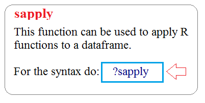

```{r setup, include=FALSE}
knitr::opts_chunk$set(echo = TRUE)
options("width"=512)

#--
# Function to install and load required packages
check_pkgs <- function(project_pkgs) {
  # Install project packages (if not already installed)
  installed_pkgs <- project_pkgs %in% installed.packages()
  if(length(project_pkgs[!installed_pkgs]) > 0) install.packages(project_pkgs[!installed_pkgs])

  # Load packages into session
  lapply(project_pkgs, require, character.only=TRUE)
}

#-----------------------------
#1:  List of required packages
#-----------------------------
check_pkgs(
  c( "ggplot2",     # powerful graphics language for creating elegant and complex plots
     "dplyr",        # provides data manipulating functions
     "xts",         # Loads package zoo for time series manipulation
     "scales",      # library scales and the function scale_x_datetime
     "car",         # multi-variate scatter plot "scatterplotMatrix()" function
     "graphics",    # pairs to produce a matrix of scatterplots
     "RColorBrewer" # visualize 
     )
)

```

<hr noshading width="75%">


## Demo on how to analyze a multivariate dataset from UCI ML data repository

### Reference materials
1. [This R Data Import Tutorial Is Everything You Need -- R bloggers](http://blog.datacamp.com/r-data-import-tutorial/)
2. [Importing Data Into R - Part Two -- R bloggers](http://www.r-bloggers.com/importing-data-into-r-part-two/)  

<hr style="border-style: solid; border-width: 1px 1px 0; border-color: palevioletred; margin-left: auto;margin-right: auto; width: 75%;">

## Data repositories
* [Financial Accounts of the United States](http://www.federalreserve.gov/datadownload/Choose.aspx?rel=Z.1) 
* [DATA.GOV](https://www.data.gov/)
* [UCI Data Repository](http://archive.ics.uci.edu/ml/) -- <em>Machine learning datasets</em>  

## Financial Data repositories
* [Federal Reserve](http://www.federalreserve.gov/releases) -- <em>few clicks required</em> financial_accounts_of_the_us.png
* [Data Market](https://datamarket.com/data/list/?q=provider:tsdl) <em>one of the user friendly Websites -- few clicks required</em> 
* [INFORUM](http://inforumweb.umd.edu/econdata/econdatacontents.html) -- <em>requires Inforum's database and regression package, G, to access that data</em>

## Big Data repositories
* [Data Science Central](http://www.datasciencecentral.com/profiles/blogs/big-data-sets-available-for-free) 
* [Big data made simple](http://bigdata-madesimple.com/70-websites-to-get-large-data-repositories-for-free/)  
* [Amazon Web Service (AWS)](https://aws.amazon.com/public-data-sets/)
* [caesar0301/awesome-public-datasets](https://github.com/caesar0301/awesome-public-datasets)

<hr style="border-style: solid; border-width: 1px 1px 0; border-color: palevioletred; margin-left: auto;margin-right: auto; width: 75%;">

## Steps:
1. Visit the [UCI wine data repository](http://archive.ics.uci.edu/ml/datasets/Wine) for a detailed description, the data dictionary and maintainer of the data
<ul>
 <li>results of a chemical analysis of the qualities of wines grown in the same region in Italy but derived from 3 different cultivars (<em>a plant variety that has been produced in cultivation by selective breeding</em>)</li>
 <li><b>14</b> columns (dimensions, attributes)</li>
 <li>with <b>1st</b> column containing the cultivar of a wine sample (labelled 1, 2 or 3)</li> 
 <li>next <b>13</b> columns contain the concentrations of the 13 different chemicals in that sample</li>
</ul><p>


2. Setup your project workspace and <em>cd</em> into that direction (Session -> Set Working Directory -> Choose Directory (<font color="red">CNTRL+Shift+h</font>)

3. Read dataset into R 
<ul>
<li><em>read.table(...)</em></li>
<li>I always get a segment of the file first (for very large files)<br>
    <font color="red">read.table("</font><em><b>my_some_datatable_name.txt</b></em><font color="red">" header = TRUE, nrows = 25)</font>           # easier to work with smaller dataset</li>
</ul>

<hr noshading>

### Step 1 of N: Point browser to the UCI wine dataset repository
* [UCI ML wine dataset repository](http://archive.ics.uci.edu/ml/datasets/Wine)

### Step 2 of N: Clear workspace, and set and cd into working directory
```{r eval=FALSE}
         
rm(list=ls())

# Set working directory and set Project-related global variables
setwd("C:/Users/William/Desktop/ECOG314/lecture_3")

# You do not have to, but if you need to share variable between different functions you can use
some_global_variable1 <<- 0                       # take note of the  <<-
some_global_variable2 <<- 0                       

max_steps <-  10
  
# alternatively you can use
assign("some_global_variable3", 0)

some_local_variable1 <- 0

```

### Step 3 of N: Read the multivariate dataset into R 

<br>

#### Data structure
* Data consists of 1 row per of record (observation) wine sample. 
* First column, the cultivar of a wine sample is labelled 1, 2 or 3
* Next 12 columns contain the concentrations of the 13 different chemicals in that sample. 
* Columns are separated by <em>commas</em>.

<hr noshading width="75%" height=2>

#### Segments from the wine dataset</b>:
<pre>
 Line                       BEGIN DATA  
  #   1   2    3    4    5    6   7   8    9   10   11   12   13   14
  1   1,14.23,1.71,2.43,15.6,127,2.8,3.06,.28,2.29,5.64,1.04,3.92,1065
  2   1,13.2,1.78,2.14,11.2,100,2.65,2.76,.26,1.28,4.38,1.05,3.4,1050
  3   1,13.16,2.36,2.67,18.6,101,2.8,3.24,.3,2.81,5.68,1.03,3.17,1185
  4   1,14.37,1.95,2.5,16.8,113,3.85,3.49,.24,2.18,7.8,.86,3.45,1480
...
 58   1,13.29,1.97,2.68,16.8,102,3,3.23,.31,1.66,6,1.07,2.84,1270
 59   1,13.72,1.43,2.5,16.7,108,3.4,3.67,.19,2.04,6.8,.89,2.87,1285
 60   2,12.37,.94,1.36,10.6,88,1.98,.57,.28,.42,1.95,1.05,1.82,520
 61   2,12.33,1.1,2.28,16,101,2.05,1.09,.63,.41,3.27,1.25,1.67,680
 62   2,12.64,1.36,2.02,16.8,100,2.02,1.41,.53,.62,5.75,.98,1.59,450
...
129   2,12.37,1.63,2.3,24.5,88,2.22,2.45,.4,1.9,2.12,.89,2.78,342
130   2,12.04,4.3,2.38,22,80,2.1,1.75,.42,1.35,2.6,.79,2.57,580
131   3,12.86,1.35,2.32,18,122,1.51,1.25,.21,.94,4.1,.76,1.29,630
132   3,12.88,2.99,2.4,20,104,1.3,1.22,.24,.83,5.4,.74,1.42,530
...
177   3,13.17,2.59,2.37,20,120,1.65,.68,.53,1.46,9.3,.6,1.62,840
178   3,14.13,4.1,2.74,24.5,96,2.05,.76,.56,1.35,9.2,.61,1.6,560
                                END DATA 
</pre>


<hr noshading width="75%" height=2>


#### Reading the data
* We use read.table() function to read in the data into R
* We use <font color="red">sep=","</font> argument in read.table() to specify that columns are separated by commas. 

```{r }
mysample <- 25     # Using nrows, even as a mild over-estimate, will help memory usage
                   # -1 => skip record #1, i.e., the HEADER in the file, resulting in 177 records (observations)

wine <- read.table(
         file = "http://archive.ics.uci.edu/ml/machine-learning-databases/wine/wine.data",  # filename at the UCI repository
       header = TRUE,        # filehas a header
          sep = ",",         # rows separated by commas
       nrow = mysample       # just the first n=25 rows + 1 header = 26
       )

#--
# check dimension of the data you have read -- data sanity check 1
dim(wine)
class(wine)

head(wine, n=5)
```

<br>

##### BIG DATA files, import and extract a random sample into R, then offload master file onto hard drive to free up memory
* Use <em>read.table(...)</em> function to read in the data into R
* Use <em>sample(...)</em> function to get a random sample from the raw data
* Use <em>saveRDS(...)</em> and <em>rm(...)</em> functions to saVE file to hard drive and remove BIG DATA file to free up memory 
<br><br>
* For <em>Ubuntu</em> and <em>Linux</em> users, this can be done at the Operating System (OS) level
  <ul>
  <li>shuf -n 10 > small_wine_data.txt</li>  
  <li>Use <font color="red">nl wine_data.txt  | shuf -n 10</font> to verify that the lines in file has been shuffled (randomized)</li>
  </ul>
  <br>


  
```{r }

# to take a random sample of 25 rows from the file

# 
n <- sample(    x = c(1:178),      # range of rows
             size = 25,            # number of ranomly selected rows
          replace = FALSE          # sample WITHOUT replacement
      )

cat(sprintf("\nRows selected at random: %s\n", paste(n, collapse = ', ')))


# Read the data from source
big_wine.df <- read.table(          # we know from above that the class of object returned by read.table is a data.frame (.df extension)
         file = "http://archive.ics.uci.edu/ml/machine-learning-databases/wine/wine.data",  # filename at the UCI repository
       header = TRUE,               # file has a header
          sep = ","                 # rows separated by commas.  NOTE:  We took out the comma after at the end of the line
       # nrow = mysample            # we are ready every line in the file
       )

# column names
colnames(big_wine.df) <- paste("v", 1:dim(big_wine.df)[2], sep="")    #  v1, v2, ....v13, v14
head(big_wine.df)

# check dimension of the data you have read -- data sanity check 1
dim(big_wine.df)

small_wine.df <- big_wine.df[n, ]   #every row specified by n.  That is 86, 153, 78, 43, 13, 18 .... this changes if you do not specify a seed

dim(small_wine.df)

small_wine.df                      # see that indeed we are not using the entire dataset

#change the column names
colnames(small_wine.df) <- paste("v", 1:dim(small_wine.df)[2], sep="")    #  v1, v2, ....v13, v14
head(small_wine.df, n=5)

```

### Step 4 of N: Handle Missing Values in data

After reading the dataset into R, do a summary on your data and deal with missing values in the data, 
<br>
See [Remove/Replace/Deal with NA entries](http://forums.psy.ed.ac.uk/R/P01582/essential-10/)
```{r}
#maybe
t(summary(small_wine.df))        # t(..) to transpose

# what about
apply(small_wine.df, 2, function(x) sum(is.na(x)))


# what about big wine
t(summary(big_wine.df))

#Elegant way to report missing values in a data.frame:  http://stackoverflow.com/questions/8317231/elegant-way-to-report-missing-values-in-a-data-frame
sapply(big_wine.df, function(x) sum(is.na(x)))
```

### Step 4 of N: Plotting Multivariate Data

After reading the dataset into R, the next step is usually to plot of the resuulting data
<br>
See [Scatterplot matrices in R](https://www.r-bloggers.com/scatterplot-matrices-in-r/)

#### A Matrix Scatterplot

For multivariate data, one usually makes a <font color="red">matrix scatterplot</font>, showing each pair of variables plotted against each other. The <em>scatterplotMatrix(...)</em> function is avialable in the </em>car</em> package.  That is: <em>install.packages("car"); libray(car)</em>

```{r warning=FALSE}

#-
# Plot #1: A matrix scatterplot
windows()
scatterplotMatrix(small_wine.df[, 2:6],                  # exclude column 1, class label
                  main="Small Wine  Scatterplot Matrix"   # title of plot
                  )

#--
# panel.smooth function is built in.
# panel.cor puts correlation in upper panels, size proportional to correlation
panel.cor <- function(x, y, digits=2, prefix="", cex.cor, ...)
{
    usr <- par("usr"); on.exit(par(usr))
    par(usr = c(0, 1, 0, 1))
    r <- abs(cor(x, y))
    txt <- format(c(r, 0.123456789), digits=digits)[1]
    txt <- paste(prefix, txt, sep="")
    if(missing(cex.cor)) cex.cor <- 0.8/strwidth(txt)
    text(0.5, 0.5, txt, cex = cex.cor * r)
}

# Plot #2: same as above, but add loess smoother in lower and correlation in upper
windows()
pairs(big_wine.df[, 2:6],
      lower.panel=panel.smooth,             # lower portion of plot is the smooth plot
      upper.panel=panel.cor,                # uppper portion is a correlation plot
      pch=23,               # plot symbols, see http://www.statmethods.net/advgraphs/parameters.html
      main="Big Wine  Scatterplot Matrix",
      na.action = na.omit                   # causes cases with missing values in any of the variables to be omitted entirely.
      )
```

##### Scatterplot with data Points labelled by group

<font color="red">Observation</font>
If you observe any interesting scatterplot for any two variables in the matrix scatterplot, plot that scatterplot in more detail, with the data points labelled by their group (their cultivar, i.e., v1 .. v14)

For example, the <em>pair plot</em> above, shows the 3rd column of the 4th row down is a scatterplot of V4 (x-axis) against V5 (y-axis). The figure shows a correlation of 0.45, that is a positive relationship between V4 and V5.


<hr noshading width="75%">
##### Zoom  in on any interesting relationship with a plot
Use <em>plot(x= , y= )</em> or <em>qplot(x= , y= )</em>.   I will use <em>ggplot(data= ...)</em>

```{r warning=FALSE}
# simplr plot
## define base for the graphs and store in object 'p'

v4_v5.plot <- ggplot(data = big_wine.df, aes(x = v4, y = v5, group=v1, color=factor(v1), shape=factor(v1)))

## just plotting points (a.k.a., scatterplot)
windows()
v4_v5.plot + geom_point() # +  #geom_line()     # simple spaghetti plot


#---
# A more elaborate plot
# setup plot
v4_v5.plot <- ggplot(                     # cool plotting package
  data=big_wine.df,                       # dataset in this case a data.frame
  aes(
         x = v4,                          # x-axis
         y = v5,                          # y-axis
     colour= factor(v1),                  # color to use for the points
     shape = factor(v1)
    )) + 
  geom_point( size = 3)   +               # plot points only, with increased size
  xlab("V4")     +                        # x and y lables
  ylab("V5)")    +
  ggtitle("Plot of V4 vs. V5 of the wine dataset") 


v4_v5.plot <- v4_v5.plot + 
  theme(                       # the beauty of ggplot, you can add layers later
           plot.title = element_text(lineheight=1.2, face="bold", size=10.5 ),  #beautify title
           legend.position = c(1.01, 0.28), legend.justification=c(1,1),     #position the legend
      legend.position = "bottom", legend.justification=c(1,1),                 #position the legend
          legend.text = element_text(size=6.5),                                #format legend text
          axis.text.x = element_text(size=6.5),                                #format x-axis text
         axis.title.x = element_text(size = rel(0.75))                         #format x-axis title
  )

#--


#open a display window, else R will use RStudio's window
windows()

#-
# Add aesthetic mappings
#v4_v5.plot <- v4_v5.plot + geom_text(aes(colour = factor(v1), size=2))

# now display the plot
v4_v5.plot

```


#### Observation fom detailed plot
We can see from the plot of x=V4 versus y=V5 that 
<ul>
  <li>wines from cultivar 1 seem to have lower values of V5 compared to the wines of cultivar 2 and 3</li>
  <li>wines from cultivar 2 seem to have lower values of V4 compared to the wines of cultivar 1</li>
</ul>


<hr style="border-style: solid; border-width: 1px 1px 0; border-color: palevioletred; margin-left: auto;margin-right: auto; width: 75%;">


### A Profile Plot

[Good reference for profile plot](https://cran.r-project.org/web/packages/profileR/vignettes/jss_profileR.pdf)

[Useful functions for Multivariate data analysis](http://www.uni-regensburg.de/wirtschaftswissenschaften/vwl-tschernig/medien/programmieren-mit-r/pmr_tut_multivariatedataanalysis.r)

<hr noshading width="75%">

<br>
Another useful plot is a <font color="red">profile plot</font> which plots the value of each of the variables for each of the samples to show the variation in each of the variables.

* Use the function <em>makeProfilePlot(...)</em> to make a profile plot. 
  ++ Note: The <em>makeProfilePlot(...)</em> function requires the <em>RColorBrewer</em> library

<br>


#### A profile plot of the concentrations of the first 9 chemicals in the wine samples in columns V2, V3, V4, V5, V6, v7, v8, v9 of the big_wine dataset

```{r warning=FALSE}

source("helper_functions/pmr_tut_multivariatedataanalysis_edited_by_william.r")

#  Gives us access to the following functions:
# 1: makeProfilePlot

chem.names <- paste("V", 2:9, sep="")

mylist <- list(big_wine.df$v2, big_wine.df$v3, big_wine.df$v4, big_wine.df$v5,
               big_wine.df$v6, big_wine.df$v7, big_wine.df$v8, big_wine.df$v9)

#--
windows()

makeProfilePlot(mylist, chem.names, 
                title=sprintf("Profile plot of: %s", paste(chem.names, collapse = ', '))
                )
grid()
```

#### Observation fom detailed plot
We can see from the profile plot that 
* the mean and standard deviation for V6 is quite a lot higher than that for the other variables.

<br>
<hr style="border-style: solid; border-width: 1px 1px 0; border-color: palevioletred; margin-left: auto;margin-right: auto; width: 75%;">

<br>

### Calculating Summary Statistics for Multivariate Data
* For statistics on a dataset refer to the <em>Mosaic</em> package.
* Here we would calculate 2 summary statistics for each of the variables in the wine data set
* Use <em>sapply</em> 
<ul>
<li> mean</li>
<li> standard deviation</li>
</ul>

```{r warning=FALSE}

sapply(big_wine.df[, 2:9], mean)         #mean and std of 2nd to 9th variables

sapply(big_wine.df[, 2:9], sd)

# per sample type
group1_index = which(big_wine.df$v1 == 1); head(group1_index)   # get the index 
group2_index = which(big_wine.df$v1 == 2); head(group2_index)
group3_index = which(big_wine.df$v1 == 3); head(group3_index)

sapply(big_wine.df[ group1_index, 2:9], mean)         #mean and std of 2nd to 9th variables
sapply(big_wine.df[ group2_index, 2:9], mean) 
sapply(big_wine.df[ group3_index, 2:9], mean) 

```


#### Observation 
* We are only able to compute the mean and standard deviation of the 2-9 chemicals' concentrations for just cultivar 1 samples, or for just cultivar 3 samples, in a similar way.
statistics by variable for the entire group.  

* What about by group with with just 1 line of command?  [Use google, e.g.:  "r calculating standard deviation by group in a data"](http://stackoverflow.com/questions/16367436/compute-mean-and-standard-deviation-by-group-for-multiple-variables-in-a-data-fr)

```{r}

t( big_wine.df %>% group_by(v1) %>% summarise_each(funs(mean, sd)) )  # transpose

```
